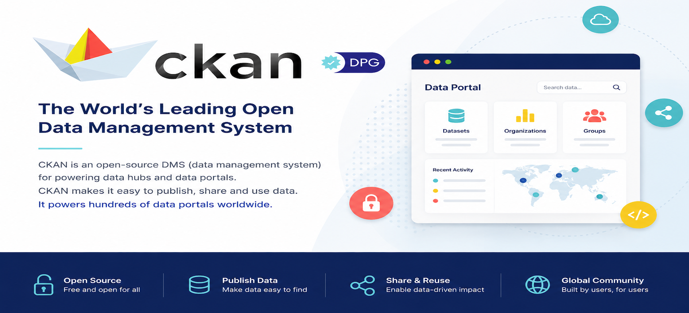

# CKAN: ckan.org Website

<p align="center">
  
</p>

> Source code for the **ckan.org** website — the CKAN project site, built with **Django 5.2.17** and **Wagtail 7.4**.


## Quick Links

| Resource | Link |
| --- | --- |
| 🌍 Live site | <https://ckan.org/> |
| 📚 Documentation | <https://docs.ckan.org/> |
| 💻 GitHub (CKAN repos) | <https://github.com/ckan> |
| ✨ Features | <https://ckan.org/features> |
| 🗂️ Showcase (portals) | <https://ckan.org/showcase> |
| 📝 Blog | <https://ckan.org/blog> |
| 📅 Events | <https://ckan.org/events> |
| ❓ FAQ | <https://ckan.org/faq> |
| 🛟 Support — community | <https://ckan.org/community> |
| 🛟 Support — commercial | <https://ckan.org/commercial> |

## Information

- **Title:** `ckan.org`
- **Preview:** <https://ckan.org/>
- **Tech stack:** Python 3.11+ · Django 5.2.17 · Wagtail 7.4

## Directory Hierarchy

Condensed, collapsible overview of the repository layout.

<details open>
<summary>📂 <code>ckan-org/</code> — Django + Wagtail project root</summary>

```text
ckan-org/
├── ckanorg/                 # Django project core
│   ├── settings/base.py     #   main settings (DB, cache, email, Wagtail)
│   ├── static/              #   global source assets (css, js, img, fonts, scss)
│   ├── templates/           #   base.html, header.html, footer.html + per-app templates
│   └── urls.py · views.py · wsgi.py
│
├── Wagtail apps — each has models.py, admin.py, views.py, urls.py, tests.py,
│   migrations/ (and templatetags/ where needed):
│   ├── home/ · blog/ · events/ · stories/ · anniversary/
│   ├── portals/ · ckan_pages/ · faq/ · contact/ · managers/
│   └── menus/ · dashboard/ · search/ · streams/
│
├── scss/                    # Sass sources compiled into the static output
├── static/                  # collected static output (STATIC_ROOT / Whitenoise)
├── media/                   # user uploads (symlink to shared storage on servers)
├── cache/                   # wagtail-cache page cache (symlink on servers)
│
├── manage.py                # Django management entrypoint
├── requirements.txt         # Python dependencies
├── Dockerfile · deploy.sh · bitbucket-pipelines.yml
├── robots.txt · checklist.md · .gitignore
└── LICENSE.txt · README.md
```

</details>

> ⚠️ **Note:** `streams/` is tracked in this repo but is a **legacy parallel copy** of the project, not the live tree. Always make changes in the repo-root apps (`contact/`, `blog/`, `home/`, `ckanorg/templates/`, …).

## Install & Dependencies

The site runs on Python 3.11+ with the following core stack (see `requirements.txt` for the full list):

- **Python** 3.11+
- **Django** 5.2.17
- **Wagtail** 7.4
- **Database:** PostgreSQL 12+ (SQLite is fine for local development)

### Local environment setup

The steps below assume a fresh local clone on Linux/macOS. Production uses PostgreSQL; for local development you can use SQLite (see steps 3 and 7).

#### 1. Create a virtual environment and activate it.
```
python3 -m venv wagenv 
```
```
source wagenv/bin/activate 
```

#### 2. Clone the repository and change into the folder:

```
git clone https://github.com/ckan/ckan.org.git
```

#### 3. SQLite only: comment out `psycopg2` in `requirements.txt` (keep it if using PostgreSQL).

#### 4. Install `wheel` library 
```
pip install wheel
```

#### 5. Install the project dependencies from `requirements.txt` (mind the pinned versions).
```
pip install -r requirements.txt
```

#### 6. Prepare the local `media/` and `static/` folders

Remove the tracked `cache` and `media` links (they point to shared server storage), create the local folders, and collect the static files:

```
mkdir -p media static
python manage.py collectstatic
```

#### 7. Use SQLite for local development (switch the database in the settings):

```
diff --git a/ckanorg/settings/base.py b/ckanorg/settings/base.py
index be311ca..ec8777f 100644
--- a/ckanorg/settings/base.py
+++ b/ckanorg/settings/base.py
@@ -225,11 +225,7 @@ with open(BASE_DIR + '/../config/secret.txt') as f:
 
 DATABASES = {
     'default': {
-        'ENGINE': 'django.db.backends.postgresql_psycopg2',
-        'NAME': 'ckanorg',
-        'USER': 'ckanorg',
-        'PASSWORD': DB_PASS,
-        'HOST': DB_HOST,
-        'PORT': 5432,
+        'ENGINE': 'django.db.backends.sqlite3',
+        'NAME': os.path.join(BASE_DIR, 'db.sqlite3'),
     }
 }
```

> **Note:** Wagtail 7.4 targets PostgreSQL 12+; SQLite is only a convenience for local development.

#### 8. Set up the database

- **Recommended:** copy the shared dummy `db.sqlite3` file (ask the managers) into the `ckan.org` folder so you don't have to rebuild every page from scratch.
- **Otherwise** migrate a fresh database:

```
python manage.py makemigrations
python manage.py migrate
```

> 💡 **Helpful — avoid first-run `DoesNotExist` crashes on a fresh database**
>
> If you start from an empty database, the front end crashes with `Page.DoesNotExist` on the very first load: the footer template tag `` in `ckanorg/templates/footer.html` calls `Page.objects.get(slug='blog')`, which requires the Wagtail page tree to already exist.
>
> To avoid this, use the shared dummy `db.sqlite3` above, **or**, when migrating from scratch, run `python manage.py createsuperuser` and create the core top-level pages (at minimum a Blog listing page with slug `blog`, the home page and the Wagtail site record) in the admin **before** opening `http://127.0.0.1:8000/`.

#### 9. Disable the Wagtail cache for local development:

```
diff --git a/ckanorg/settings/base.py b/ckanorg/settings/base.py
index be311ca..3837822 100644
--- a/ckanorg/settings/base.py
+++ b/ckanorg/settings/base.py
@@ -49,7 +49,6 @@ INSTALLED_APPS = [
     'wagtail.admin',

-    'wagtailcache',
     'modelcluster',
     'taggit',
 
@@ -87,18 +86,8 @@ MIDDLEWARE = [
     'django.contrib.messages.middleware.MessageMiddleware',
     'django.middleware.clickjacking.XFrameOptionsMiddleware',
     'wagtail.contrib.redirects.middleware.RedirectMiddleware',
-    'wagtailcache.cache.FetchFromCacheMiddleware',
 ]
 
-CACHES = {
-    'default': {
-        'BACKEND': 'django.core.cache.backends.filebased.FileBasedCache',
-        'LOCATION': os.path.join(BASE_DIR, 'cache'),
-        'KEY_PREFIX': 'wagtailcache',
-        'TIMEOUT': 3600, # one hour (in seconds)
-    }
-}
-
 X_FRAME_OPTIONS = 'ALLOWALL'
 ROOT_URLCONF = 'ckanorg.urls'
```

#### 10. Re-configure the email backend:

```
diff --git a/ckanorg/settings/base.py b/ckanorg/settings/base.py
index be311ca..d0b68dc 100644
--- a/ckanorg/settings/base.py
+++ b/ckanorg/settings/base.py
@@ -192,11 +181,13 @@ WAGTAIL_SITE_NAME = "ckanorg"
 BASE_URL = '<https://ckan.org'>
 
 EMAIL_BACKEND = 'django.core.mail.backends.smtp.EmailBackend'
-EMAIL_HOST = 'email-smtp.eu-central-1.amazonaws.com'
+EMAIL_HOST = 'smtp.gmail.com'
 EMAIL_USE_TLS = True
 EMAIL_PORT = 587
-DEFAULT_FROM_EMAIL = 'noreply@ckan.org'
+EMAIL_HOST_USER = 'linkdigitaltest@gmail.com'
+DEFAULT_FROM_EMAIL = 'linkdigitaltest@gmail.com'
+EMAIL_HOST_PASSWORD = 'my-password'
+
 
 ACCOUNT_AUTHENTICATION_METHOD = 'username_email'
 ACCOUNT_CONFIRM_EMAIL_ON_GET = True
```

#### 11. Remove the secret-info block and set a `SECRET_KEY`:

```
@@ -216,20 +207,11 @@ ALLOWED_HOSTS = ['*']
 
 WAGTAIL_APPEND_SLASH = False
 
-with open(BASE_DIR + '/../config/secret.txt') as f:
-    data = f.read().strip().split(',')
-    SECRET_KEY = data[0]
-    EMAIL_HOST_PASSWORD = data[1]
-    DB_HOST = data[2]
-    DB_PASS = data[3]
-    RECAPTCHA_PUBLIC_KEY = data[4]
-    RECAPTCHA_PRIVATE_KEY = data[5]
-    EMAIL_HOST_USER = data[6]
+SECRET_KEY = 'my-secret-key'
```

> 🔒 **Security — don't hardcode secrets in `settings/base.py`**
>
> `base.py` is committed to the repository, so real credentials — `SECRET_KEY`, email/DB passwords, reCAPTCHA keys — must never be hardcoded there. The placeholder values in the steps above are for **local development only**.
>
> Prefer environment variables or a git-ignored local override, e.g. add `SECRET_KEY = os.environ.get('DJANGO_SECRET_KEY', 'dev-only-insecure-key')` at the bottom of `base.py`.
>
> On servers, real secrets live in `config/secret.txt`, which sits **outside** the repo and is never committed.

#### 12. Start the local server: `python manage.py runserver`.

#### 13. Open <http://127.0.0.1:8000/> in your browser.

You will not see some images, as media folder is empty. If you need them, you can edit pages in admin section and upload your test images.
(To login as admin into the provided sqlite database, contact managers).

#### 14. Useful Django/Wagtail commands:

`python manage.py makemigrations`
`python manage.py migrate`
`python manage.py collectstatic`

to work with django models and styles.

If you want to be ensured that outdated JS bundles are removed use:
`python manage.py collectstatic --clear --noinput`

#### 15. Populate the reference table:

Populate the references table and ensure that usage counts for images, documents and snippets are displayed accurately

`python manage.py rebuild_references_index`

## Testing & Validation

Tests are written as Django `TestCase` classes in each app's `tests.py` (e.g. `contact/tests.py`, `faq/tests.py`, `portals/tests.py`, `stories/tests.py`, `anniversary/tests.py`).

Run the **pytest** suite from the project root (`pytest-django` picks up `DJANGO_SETTINGS_MODULE` from `manage.py`):

```bash
# Install pytest support (once)
pip install pytest pytest-django

# Run the full suite
pytest

# Run a single app / a single test case
pytest contact/ -v
pytest contact/tests.py::ParseContactFormTests -v
```

Django's built-in test runner also works:

```bash
python manage.py test
python manage.py test contact
```

A quick pre-merge validation pass:

```bash
python manage.py check
python manage.py makemigrations --check --dry-run
pytest
```

## Instructions on how to deploy changes
1. Create a new fork from `main` branch of the repository `https://github.com/ckan/ckan.org`. A fork is a copy of a repository. Forking a repository allows you to freely experiment with changes without affecting the original project. So all tasks that you push are going to our fork repository, not the main one.
If it was done earlier be sure you have cloned `main` branch of the repository with last updates.
2. Create a new branch from `main` branch of your forked repository and name it as "`[task key] / [task summary]`".
3. Make all required changes.
4. Push your finished task code to your fork repository (cloned).
5. Deploy your changes to Development environment by making a Pull Request to `develop` branch of original repository so the PO (Product owner) can merge it after he/she will test the work done on Development.

## Code Details
### Tested Platform
- software
  ```
  OS: Ubuntu 24.04.5 LTS (Lunar)
  Python: 3.12.12
  ```
- hardware
  ```
  CPU: Intel® Core™ i5
  GPU: Intel® Iris® Xe Graphics
  ```

## Contributors

Many thanks to everyone who has helped build and maintain the ckan.org website.

| GitHub | Name |
| --- | --- |
| [Alex-Pavlyuk](https://github.com/Alex-Pavlyuk) | Alex Pavlyuk |
| [alexmorev](https://github.com/alexmorev) | Aleksey Morev |
| [amercader](https://github.com/amercader) | Adrià Mercader |
| [ostyhar](https://github.com/ostyhar) | — |

## References

- **Website source:** <https://github.com/ckan/ckan.org>

## License
This material is copyright (c) 2006-2018 Open Knowledge Foundation and contributors.

It is open and licensed under the GNU Affero General Public License (AGPL) v3.0 whose full text may be found at:

http://www.fsf.org/licensing/licenses/agpl-3.0.html 
